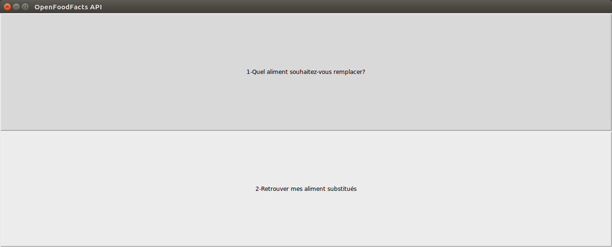

# Project Title

OpenFoodFacts interface: tkinter interface where you can pick an aliment among the differents categories proposed and get an healthier equivalent for the aliment selected and save them in database..

## Motives

The point of that application was to learn to interact with API's and database using Python.

## Libraries

[Tkinter](https://docs.python.org/3/library/tk.html)
[Requests](http://docs.python-requests.org/en/master/)
[Records](https://pypi.org/project/records/)
[Pymysql](https://github.com/PyMySQL/PyMySQL)

## Screenshots

Main menu:



1-Create a database named "offdb" using that code:  
```SQL
CREATE DATABASE offdb
CHARACTER SET "utf8";
```
2-git clone the projet_cinq repository

3-move inside the projet_cinq directory

4-run this code to install all the requirements you need to use the program:  
```Bash
pipenv install --skip-lock 
```
  followed by this code to move inside the virtual environment: 
  ```Bash
  pipenv shell
  ```


5-You need to run that code to force the creation of the database the first time you launch the program: 
```Bash
python Launcher.py -e 'update'
```
Then you can just launch the program by typing this code or force the update of the database with the previous code : 
```Bash
python Launcher.py 
```
